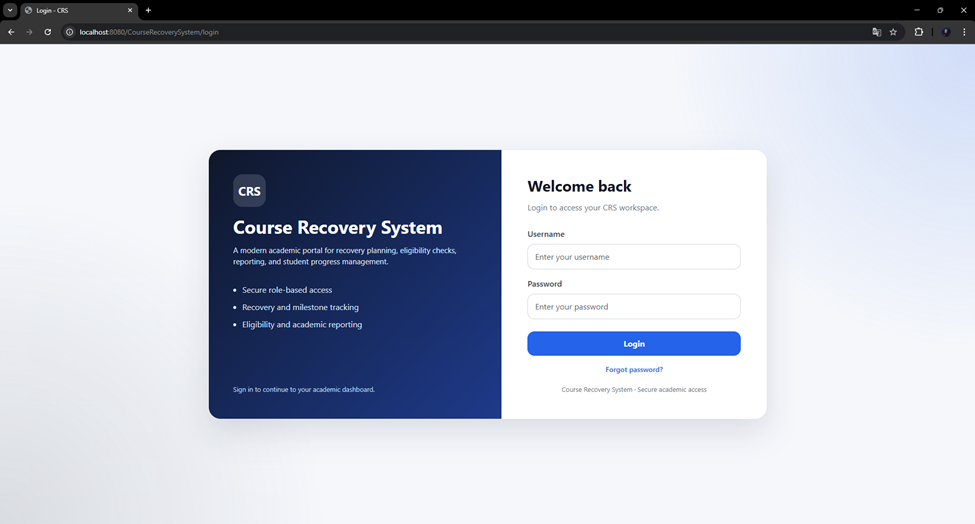
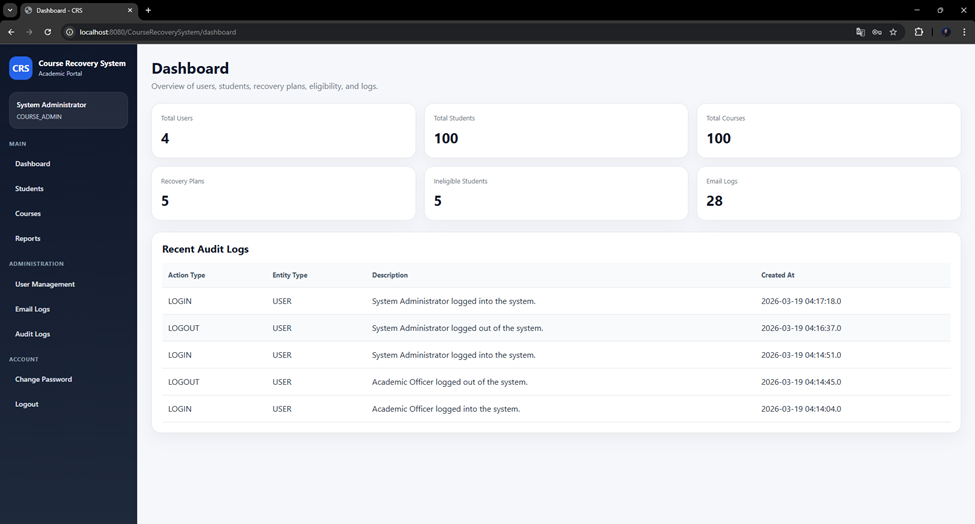
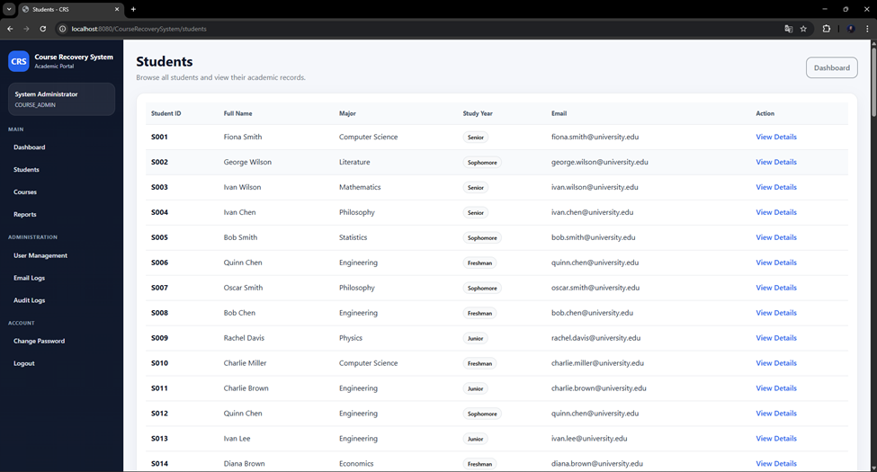
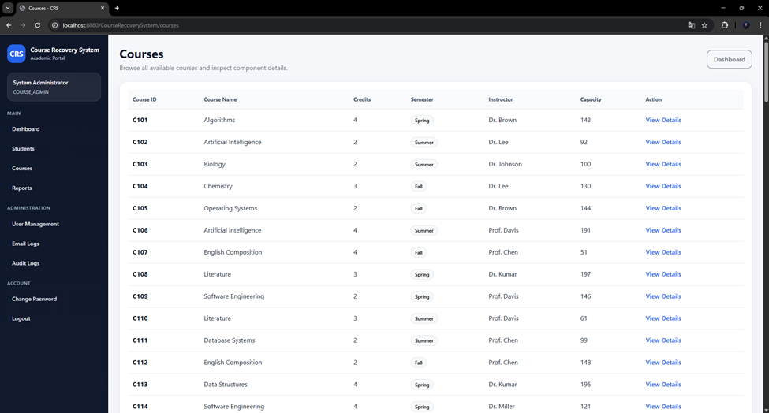
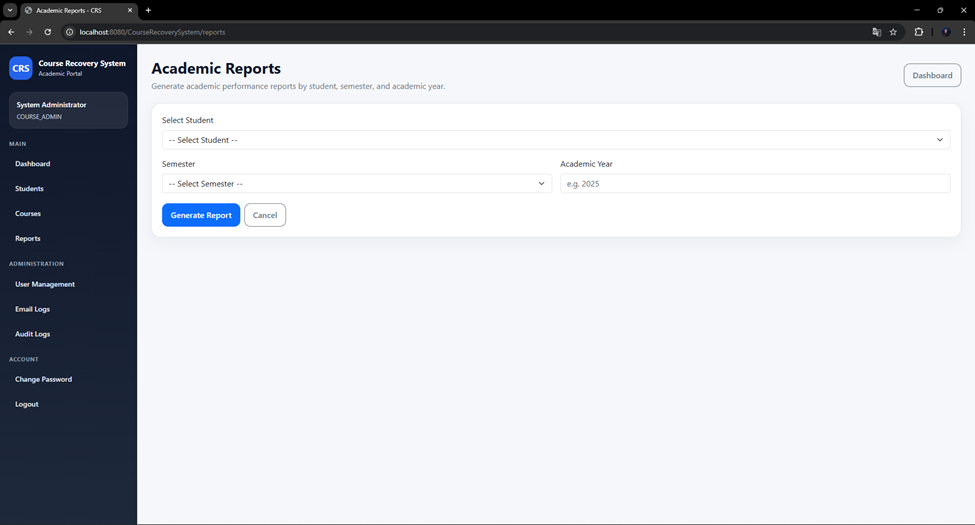
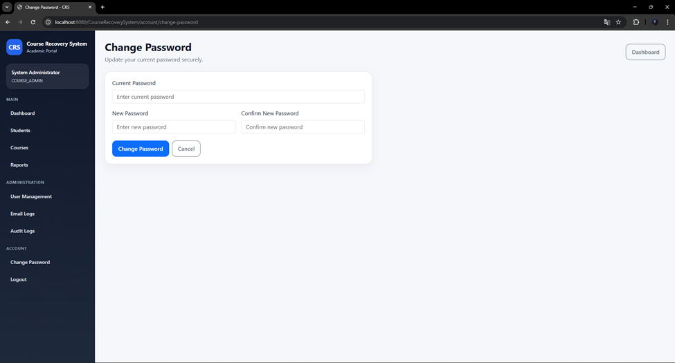

# Course Recovery System (CRS)

A Java EE web application for managing academic course recovery workflows. The system supports role-based access, student and course management, recovery planning, eligibility checks, reporting, audit logs, email logs, and secure account features.

## Overview

Course Recovery System helps academic staff manage students who need recovery actions after poor academic performance. It centralizes student records, course information, recovery plans, eligibility evaluation, enrolment decisions, reporting, and activity tracking in one portal.

## Features

- Secure login with session-based authentication
- Role-based authorization for different user types
- Dashboard with summary cards and recent audit activity
- Student listing and details view
- Course listing and component details view
- Recovery plan creation and tracking
- Eligibility checking and enrolment approval flow
- Academic report generation
- Email log and audit log tracking
- Change password and account management features

## Roles

### Course Administrator
- Manage users
- Access audit logs
- Access email logs
- View dashboard, students, courses, and reports
- Perform administration tasks

### Academic Officer
- Access recovery-related modules
- Perform eligibility checks
- Approve enrolments
- Generate academic reports
- Track student recovery progress

## Tech Stack

- Java
- Jakarta Servlet / JSP / JSTL
- Apache TomEE / Tomcat 10.1
- MySQL 8
- JDBC
- Eclipse IDE
- Git & GitHub

## Project Structure

```text
CourseRecoverySystem/
├─ src/
│  └─ main/
│     ├─ java/
│     │  └─ com/crs/
│     │     ├─ constants/
│     │     ├─ dao/
│     │     ├─ filter/
│     │     ├─ model/
│     │     ├─ service/
│     │     ├─ servlet/
│     │     └─ util/
│     └─ webapp/
│        ├─ assets/
│        └─ WEB-INF/
│           ├─ lib/
│           └─ views/
├─ database/
│  ├─ schema/
│  └─ seed/
├─ .gitignore
└─ README.md
```

## Main Modules

### Authentication and Access Control
- Login
- Logout
- Session protection
- Authorization filter
- Change password
- Forgot/reset password flow

### Dashboard
- Summary metrics
- Recent audit logs
- Quick access sidebar navigation

### Student Management
- Student list
- Student profile/details
- Academic record visibility

### Course Management
- Course list
- Course details
- Component and structure visibility

### Recovery Management
- Recovery plan creation
- Recovery plan editing
- Milestone management
- Progress entry
- Recovery details view

### Eligibility and Enrolment
- Eligibility checks
- Ineligible students listing
- Enrolment approval decisions

### Reporting
- Search and generate academic reports
- Printable report view

### Logs and Monitoring
- Email logs
- Audit logs

## Database

The project uses MySQL and includes SQL files for:

- schema creation
- workflow tables
- seed users
- seed students
- seed courses
- seed results
- seed course components
- additional student sample data

Example database name:

```sql
crs_db
```

## Setup Instructions

### 1. Clone the repository

```bash
git clone https://github.com/ALMAFLEHI/CourseRecoverySystem.git
cd CourseRecoverySystem
```

### 2. Create the database

Open MySQL Workbench and create the database, then run the SQL files from the `database/` folder.

Suggested order:

1. `database/schema/schema.sql`
2. `database/schema/workflow_tables.sql`
3. seed files from `database/seed/`

### 3. Configure database connection

Update `DBConnectionUtil.java`:

```java
private static final String URL = "jdbc:mysql://localhost:3306/crs_db?useSSL=false&serverTimezone=UTC";
private static final String USERNAME = "root";
private static final String PASSWORD = "YOUR_MYSQL_PASSWORD";
```

### 4. Add libraries

Make sure these jars are available under `WEB-INF/lib`:

- `mysql-connector-j`
- `jakarta.servlet.jsp.jstl`
- `jakarta.servlet.jsp.jstl-api`

### 5. Run on server

Deploy the project on Apache TomEE / Tomcat 10.1 from Eclipse.

Then open:

```text
http://localhost:8080/CourseRecoverySystem/login
```

## Default Test Accounts

Use the seeded users from your SQL seed files.

Example test accounts used during development:

- `admin / Admin@123`
- `officer / Officer@123`

## Screenshots

### Login Page


### Dashboard


### Students Page


### Courses Page


### Academic Reports Page


### Change Password Page


## Development Notes

- JSP files inside `WEB-INF` are protected and should not be opened directly by URL
- Access pages through their mapped servlet routes
- Use `/login` as the application entry point
- Role-based behavior is enforced through filters
- Session values are used for dashboard personalization and access control

## Future Improvements

- Better dashboard analytics and charts
- Search, pagination, and sorting across tables
- Email sending integration
- Stronger password reset flow
- Responsive UI improvements
- Export reports to PDF
- Validation and error handling enhancements

## Author

**Mohammed Almaflehi**  
Software Engineering Student  
GitHub: [ALMAFLEHI](https://github.com/ALMAFLEHI)

## License

This project is for academic and learning purposes.
